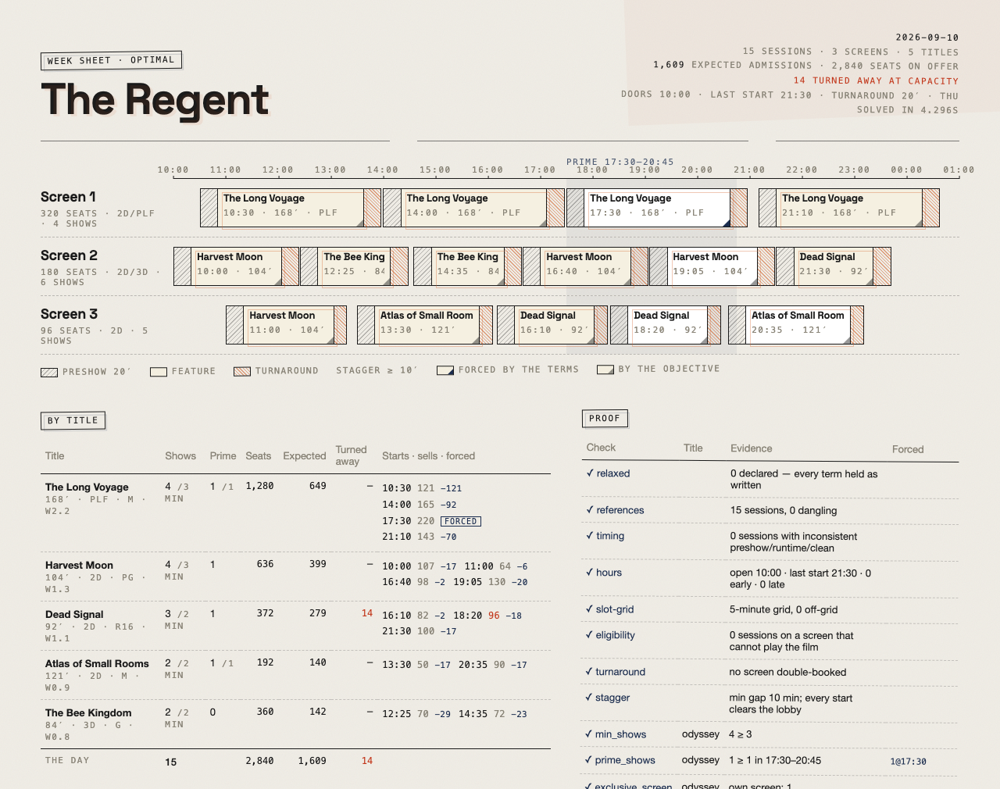
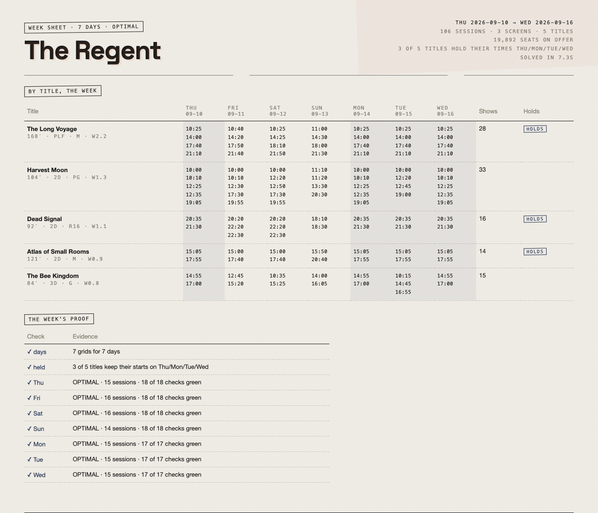
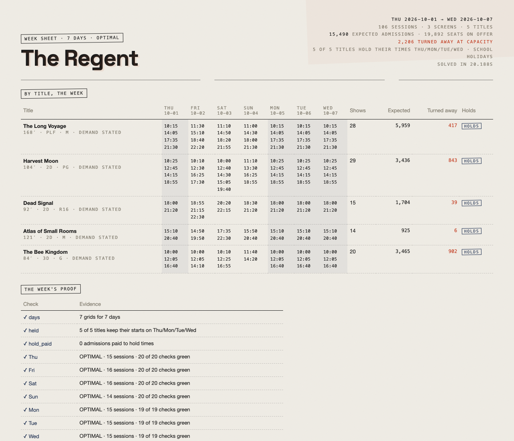
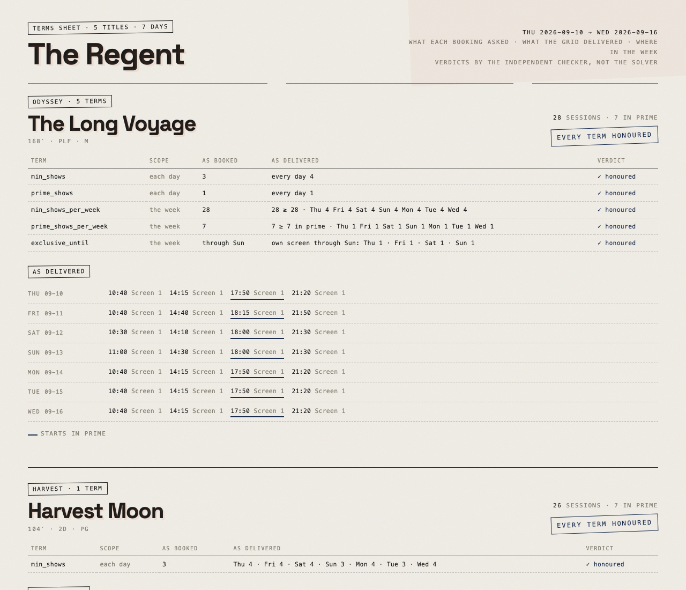

# turnaround

**The showtime grid, solved.** A constraint solver for the cinema week: every screen, every session, every distributor term, and the turnaround between them.



*The Regent — 3 screens, 5 titles, one PLF exclusive with a prime guarantee, a kids' 3D title that must start by 17:00, a horror title held to 16:00 or later. Solved `OPTIMAL` in 4.4 s for 1,609 expected admissions of 2,840 seats on offer. Every check green.*

---

## What it does

You hand it a **brief** — the house, the slate, and the house policy:

```jsonc
{
  "house": "The Regent",
  "screens": [
    { "id": "1", "capacity": 320, "formats": ["2D", "PLF"] },
    { "id": "2", "capacity": 180, "formats": ["2D", "3D"] },
    { "id": "3", "capacity": 96,  "formats": ["2D"], "clean_min": 15 }
  ],
  "films": [
    { "id": "odyssey", "title": "The Long Voyage", "runtime_min": 168, "format": "PLF", "weight": 2.2,
      "terms": { "min_shows": 3, "prime_shows": 1, "exclusive_screen": true } },
    { "id": "bees", "title": "The Bee Kingdom", "runtime_min": 84, "format": "3D", "weight": 0.8,
      "daypart_weights": { "matinee": 1.6, "prime": 0.4, "late": 0.05 },
      "terms": { "min_shows": 2, "latest_start": "17:00" } }
  ],
  "policy": { "open": "10:00", "last_start": "21:30", "preshow_min": 20, "clean_min": 20, "stagger_min": 10 }
}
```

It returns a **grid** — sessions on screens with start times — and a **proof**: every hard constraint re-verified by a checker that shares no code with the solver.

```
$ turnaround plan examples/regent.json --html sheet.html

 Screen 1  10:20 The Long Voyage · 14:00 The Long Voyage · 17:30 The Long Voyage · 21:15 The Long Voyage
 Screen 2  10:00 Harvest Moon · 12:25 Harvest Moon · 14:50 The Bee Kingdom · 16:55 The Bee Kingdom · 19:05 Harvest Moon · 21:30 Dead Signal
 Screen 3  10:10 Harvest Moon · 12:40 Harvest Moon · 15:05 Atlas of Small Rooms · 17:55 Atlas of Small Rooms · 20:35 Dead Signal

 ✓ turnaround        no screen double-booked
 ✓ stagger           min gap 10 min; every start clears the lobby
 ✓ exclusive_screen  odyssey   own screen: 1
 ✓ prime_shows       odyssey   1 ≥ 1 in 17:30–20:45
 ✓ latest_start      bees      0 after 17:00
 …
```

If the terms cannot all be met, it says `INFEASIBLE` and gives you nothing — not a grid with a distributor's minimum quietly dropped.

Hand it a **week** instead — the same house and slate, with only what differs each day — and it solves Thursday to Wednesday, keeps each title's start times the same across the weekdays where it can, and says which titles held:

```jsonc
{
  "house": "The Regent", "screens": [ … ], "films": [ … ], "policy": { … },
  "days": [
    { "name": "Thu", "date": "2026-09-10" },
    { "name": "Fri", "date": "2026-09-11", "policy": { "last_start": "22:30" } },
    { "name": "Sun", "date": "2026-09-13", "policy": { "open": "11:00" } },
    { "name": "Mon", "date": "2026-09-14", "terms": { "odyssey": { "exclusive_screen": false } } }
  ]
}
```



Tell it what each title is expected to draw — and why, in words, beside the numbers — and the objective becomes admissions. The report says who comes, who gets a seat, and who is turned away at capacity:

```jsonc
{ "id": "bees", "title": "The Bee Kingdom", "runtime_min": 84, "format": "3D",
  "demand": {
    "per_session": { "matinee": 150, "afternoon": 110, "prime": 30, "late": 5 },
    "decay": 0.6, "weekday": { "Sat": 1.3, "Sun": 1.4 }, "holiday": 1.7,
    "assumptions": [
      "G-rated 3D animation: the holiday matinee is the whole business; nothing after dinner.",
      "School holidays lift it 70%. At 150 x 1.7 the 180-seat 3D room turns people away before noon: the report should say so."
    ]
  },
  "terms": { "min_shows": 2, "latest_start": "17:00" } }
```



## Why a solver

The showtime grid is a constraint problem wearing a spreadsheet. A screen holds one thing at a time; the turnaround between features is a hard floor; two shows should not start within ten minutes of each other or the lobby cannot cope; a distributor's terms say *three shows, one in prime, its own screen*; the kids' film cannot start after five; the horror cannot start before four. A person builds this by hand every Wednesday, and the grid they arrive at is one they can live with, not one they can prove.

`turnaround` builds the grid with [OR-Tools CP-SAT](https://developers.google.com/optimization/cp/cp_solver): one boolean per (screen, film, start), an optional interval under `NoOverlap` per screen so the turnaround is inside the block, every term a linear constraint, and an objective that counts seats *sold*, not seats offered: each title's expected admissions by daypart, a second show in the same daypart drawing less than the first, no room selling more than it holds. Then it throws the grid at a second, independent reading of the same rules. Two readings that agree are evidence; one is an assertion.

## Install

```bash
uv tool install turnaround      # once it is on PyPI
# or, from source
git clone https://github.com/brunohart/turnaround && cd turnaround && uv sync
uv run turnaround plan examples/regent.json --html sheet.html
```

Python 3.13+. The only heavy dependency is `ortools`.

## Commands

| Command | What it does |
|---|---|
| `turnaround plan brief.json [--out grid.json] [--html sheet.html]` | Solve a day, or a week if the brief has `days`; print the grid and its proof. Exit 2 if infeasible, 3 if the checker ever disagrees with the solver. `--relax` drops conflicting terms one at a time, out loud. |
| `turnaround check brief.json grid.json` | Verify any grid — the solver's or one made by hand — against its brief. |
| `turnaround render brief.json grid.json --html sheet.html` | Render an existing grid as the week sheet. |
| `turnaround terms brief.json grid.json --html terms.html` | The terms sheets: one page per title, every term the booking carries, its scope, what the grid delivered day by day, and the checker's verdict — the document a programmer sends back to the distributor. |
| `turnaround validate brief.json` | Validate and summarise a brief; refuse a bad one in sentences. |

## The brief

**Screens** have `capacity`, `formats` (`2D`, `3D`, `PLF`, or your own names) and an optional `clean_min` override.

**Films** have `runtime_min`, `format`, an optional **demand** block (`per_session` admissions by daypart for the first show, `decay` per further show in the same daypart, `weekday` and `holiday` multipliers, `assumptions` in words), or failing that a `weight` (2.0 draws twice 1.0) and optional `daypart_weights` that stand in for one, and **terms**:

| Term | Meaning |
|---|---|
| `min_shows` / `max_shows` | Sessions today, at least / at most |
| `prime_shows` | Sessions starting inside the prime window, at least |
| `exclusive_screen` | Must have a screen playing nothing else today |
| `earliest_start` / `latest_start` | Start window, `HH:MM` |
| `screens` | Only these screen ids |
| `min_capacity` | Only rooms at least this big |
| `plf_lock` | Every session on a PLF room is this title's; no other title plays a PLF screen while it is booked |
| `min_shows_per_week` / `prime_shows_per_week` | Across the week, at least (a week term; a day brief refuses it) |
| `exclusive_until` | A day name: the exclusive holds through that day and lifts the day after (a week term) |

A brief the tool cannot take is refused in sentences, not stack traces: *"Dead Signal: earliest_start 16:00 is after latest_start 15:00 — no session could start"*, *"The Long Voyage → terms: `min_show` is not a term a booking can carry — the fields are min_shows, max_shows, …"*, *"The Long Voyage: plf_lock asks for every PLF room and the house has none — the screens play 2D, 3D"*.

**Policy**: `open`, `last_start` (hours past 24 are fine: `"25:00"` is 1 a.m.), `preshow_min`, `clean_min`, `stagger_min`, `slot_min`, `school_holiday`, `assumed_admissions` (what a weight-1.0 title's first prime show draws when no demand is stated), and the `dayparts` with their weights (matinee / afternoon / prime / late by default).

**The booth's realities** (Day 4): a film's `credits_min` lets the turnaround begin that many minutes before the feature ends, so the block shrinks and the room is clear at the later of feature end and turnaround end; `policy.preshow_by_format` gives 3D or PLF a longer preshow than the house figure; `policy.max_concurrent_turnarounds` is how many rooms the floor staff can clear at once (a cumulative in the model, a count in the checker); a screen may carry its own `open` and `last_start`; and the stagger is a window, `stagger_min` minutes wide with at most `max_starts_per_window` starts in it (the default is 1 in 10). In a week brief a day may also override a screen (`"screens": { "3": { "open": "12:00" } }`) so Screen 3 can open at noon on weekdays. `examples/booth.json` is the Regent with all of it.

**A week** adds `days`: up to seven of `{ "name", "date", "policy": { … }, "terms": { film_id: { … } } }`, each carrying only what differs from the base. `hold_days` (default Mon–Thu) are the days a title should keep the same start times; `hold_penalty` is what the objective gives up per title that changes them. Every day is solved and checked on its own; the week sheet puts the by-title table across all seven days first and each day's grid on its own page.

**Week terms** (Day 5) live in the same `terms` block: `"exclusive_until": "Sun"` holds the opening exclusive through Sunday and lifts it Monday; `"min_shows_per_week": 28` and `"prime_shows_per_week": 7` are counted across the week. The week is still solved day by day: each day is asked for what the week term still owes after the days before and what the days after could carry, and the checker re-counts the week from the sessions alone. `turnaround terms` prints the terms sheets, one page per title.



## What it does not do yet

This is Day 5 of a fourteen-day build (`PLAYBOOK.md`). Not here yet: the full print identity (Day 6); *why* each session is where it is (Day 7); scale benchmarks (Day 8); CSV/iCal in and out (Day 9); a festival profile (Day 10); grid diffs for the Thursday re-plan (Day 11); a static board (Day 12).

The design decisions and their reasons are in `DECISIONS.md`. The log of what each day shipped and what it left rough is in `docs/LOG.md`.

## Proof

```bash
scripts/build.sh    # ruff, format check, mypy --strict
scripts/test.sh     # pytest
scripts/run.sh      # solve every example into docs/grids/, then `turnaround check` each
```

CI runs all three on every push.

## Licence

MIT. Built by designedbybruno. Not affiliated with any cinema software vendor; the brief is the tool's own format.
