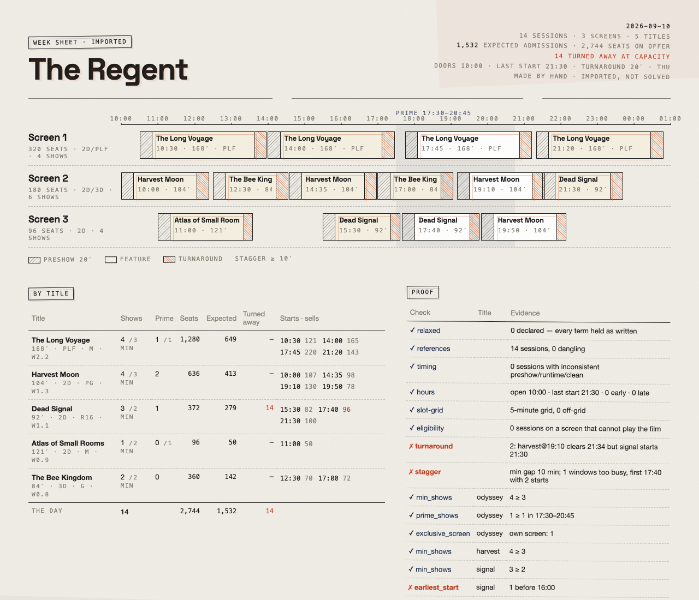
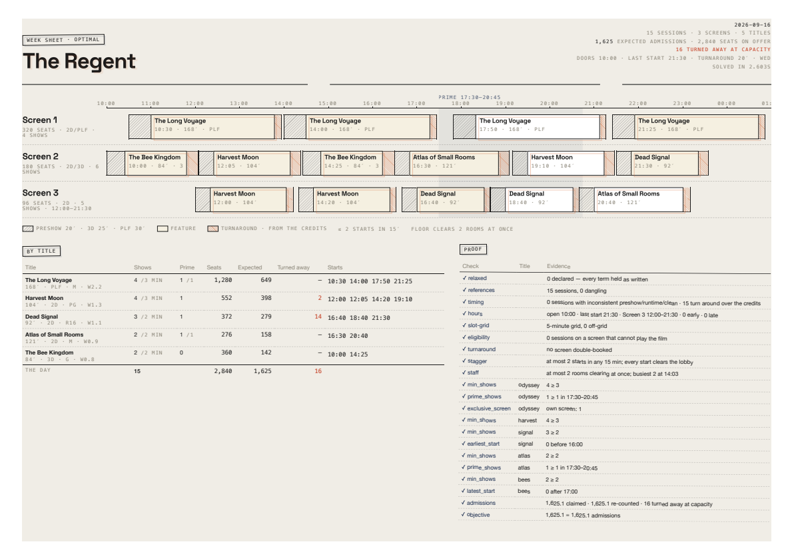
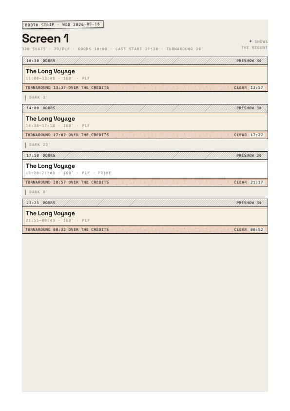
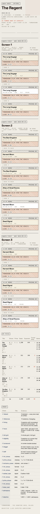
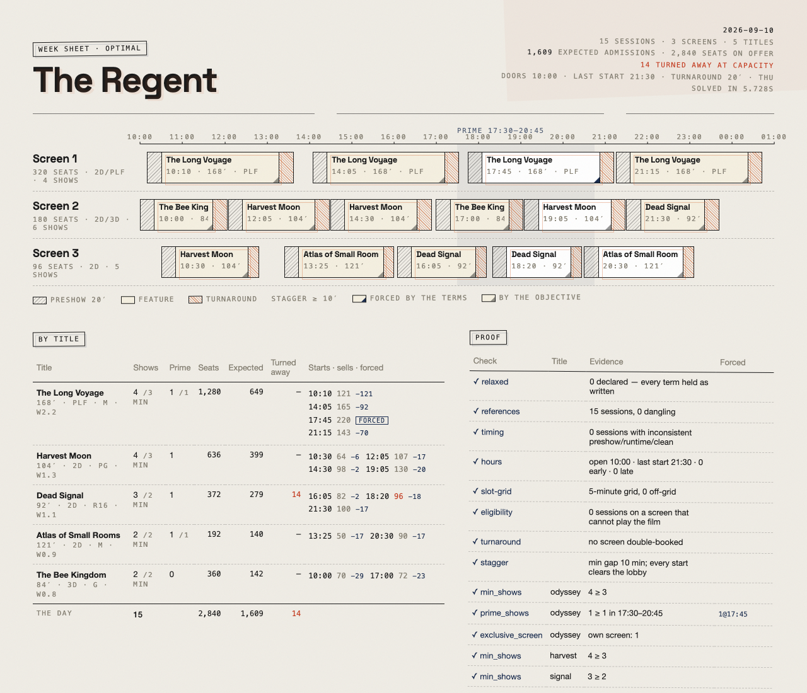
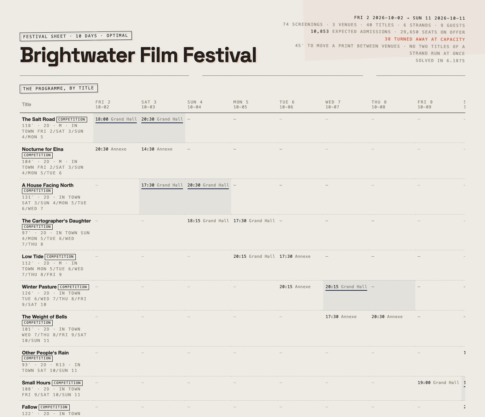
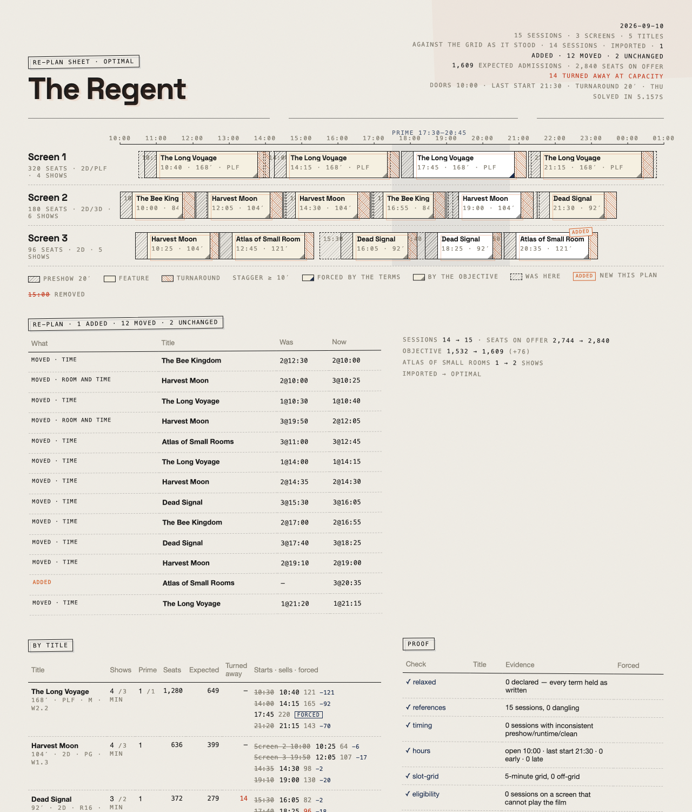
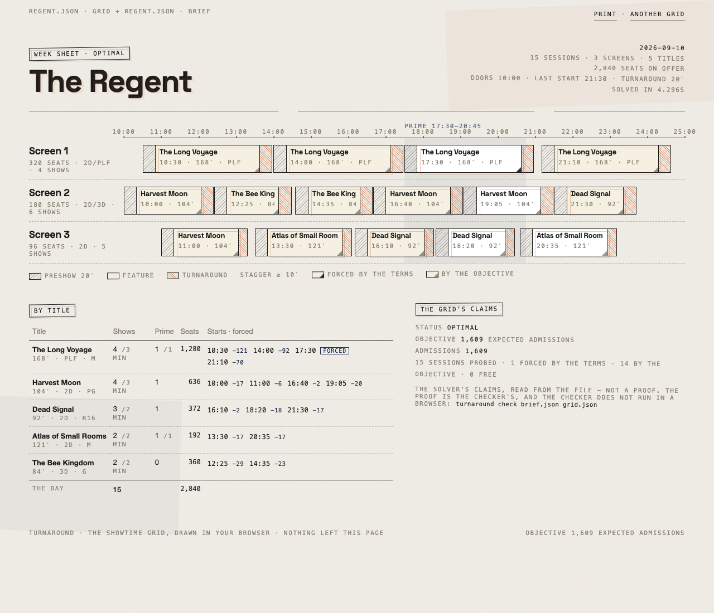
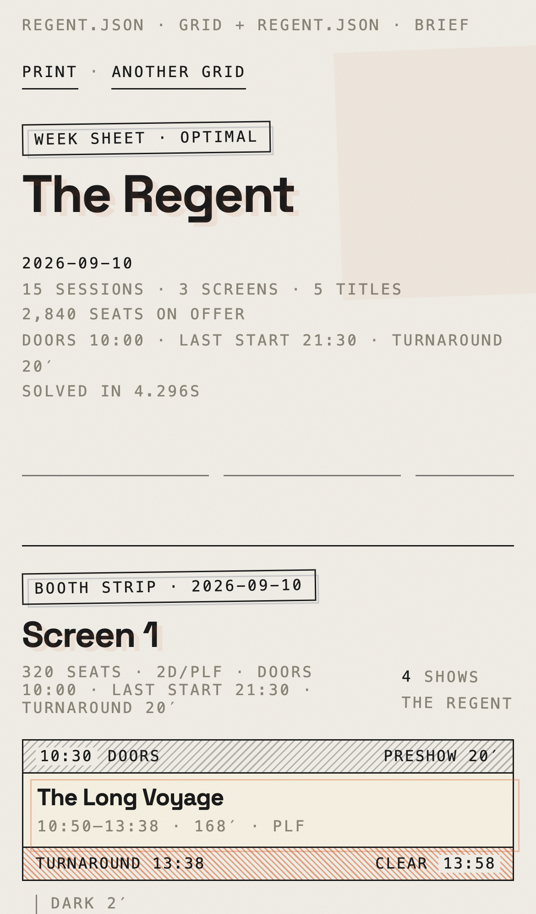
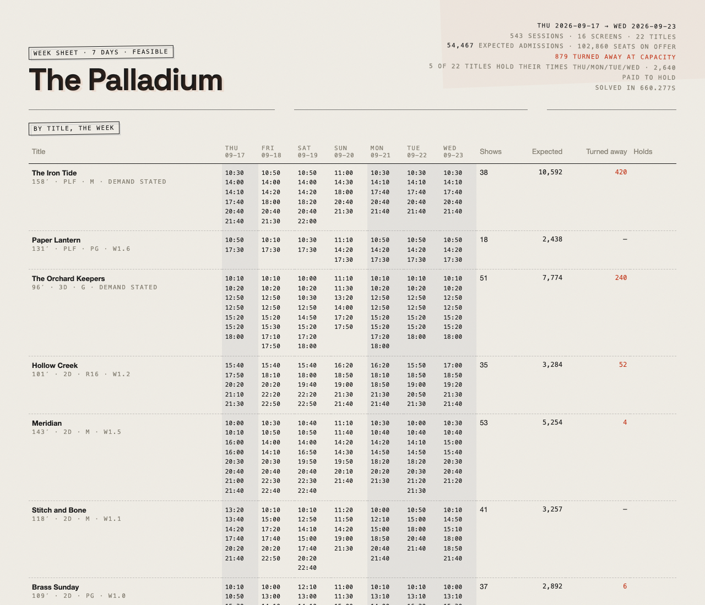

# turnaround

**The showtime grid, solved.** A constraint solver for the cinema week: every screen, every session, every distributor term, and the turnaround between them.


*The Regent — 3 screens, 5 titles, one PLF exclusive with a prime guarantee, a kids' 3D title that must start by 17:00, a horror title held to 16:00 or later. Solved and proven `OPTIMAL` in about five seconds for 1,609 expected admissions of 2,840 seats on offer. Every check green.*

---

## What it does

You hand it a **brief** — the house, the slate, and the house policy:

```jsonc
{
  "house": "The Regent",
  "screens": [
    { "id": "1", "capacity": 320, "formats": ["2D", "PLF"] },
    { "id": "2", "capacity": 180, "formats": ["2D", "3D"] },
    { "id": "3", "capacity": 96,  "formats": ["2D"], "clean_min": 15 }
  ],
  "films": [
    { "id": "odyssey", "title": "The Long Voyage", "runtime_min": 168, "format": "PLF", "weight": 2.2,
      "terms": { "min_shows": 3, "prime_shows": 1, "exclusive_screen": true } },
    { "id": "bees", "title": "The Bee Kingdom", "runtime_min": 84, "format": "3D", "weight": 0.8,
      "daypart_weights": { "matinee": 1.6, "prime": 0.4, "late": 0.05 },
      "terms": { "min_shows": 2, "latest_start": "17:00" } }
  ],
  "policy": { "open": "10:00", "last_start": "21:30", "preshow_min": 20, "clean_min": 20, "stagger_min": 10 }
}
```

It returns a **grid** — sessions on screens with start times — and a **proof**: every hard constraint re-verified by a checker that shares no code with the solver.

```
$ turnaround plan examples/regent.json --html sheet.html

 Screen 1  10:20 The Long Voyage · 14:00 The Long Voyage · 17:30 The Long Voyage · 21:15 The Long Voyage
 Screen 2  10:00 Harvest Moon · 12:25 Harvest Moon · 14:50 The Bee Kingdom · 16:55 The Bee Kingdom · 19:05 Harvest Moon · 21:30 Dead Signal
 Screen 3  10:10 Harvest Moon · 12:40 Harvest Moon · 15:05 Atlas of Small Rooms · 17:55 Atlas of Small Rooms · 20:35 Dead Signal

 ✓ turnaround        no screen double-booked
 ✓ stagger           min gap 10 min; every start clears the lobby
 ✓ exclusive_screen  odyssey   own screen: 1
 ✓ prime_shows       odyssey   1 ≥ 1 in 17:30–20:45
 ✓ latest_start      bees      0 after 17:00
 …
```

If the terms cannot all be met, it says `INFEASIBLE` and gives you nothing — not a grid with a distributor's minimum quietly dropped.

Hand it a **week** instead — the same house and slate, with only what differs each day — and it solves Thursday to Wednesday, keeps each title's start times the same across the weekdays where it can, and says which titles held:

```jsonc
{
  "house": "The Regent", "screens": [ … ], "films": [ … ], "policy": { … },
  "days": [
    { "name": "Thu", "date": "2026-09-10" },
    { "name": "Fri", "date": "2026-09-11", "policy": { "last_start": "22:30" } },
    { "name": "Sun", "date": "2026-09-13", "policy": { "open": "11:00" } },
    { "name": "Mon", "date": "2026-09-14", "terms": { "odyssey": { "exclusive_screen": false } } }
  ]
}
```


Tell it what each title is expected to draw — and why, in words, beside the numbers — and the objective becomes admissions. The report says who comes, who gets a seat, and who is turned away at capacity:

```jsonc
{ "id": "bees", "title": "The Bee Kingdom", "runtime_min": 84, "format": "3D",
  "demand": {
    "per_session": { "matinee": 150, "afternoon": 110, "prime": 30, "late": 5 },
    "decay": 0.6, "weekday": { "Sat": 1.3, "Sun": 1.4 }, "holiday": 1.7,
    "assumptions": [
      "G-rated 3D animation: the holiday matinee is the whole business; nothing after dinner.",
      "School holidays lift it 70%. At 150 x 1.7 the 180-seat 3D room turns people away before noon: the report should say so."
    ]
  },
  "terms": { "min_shows": 2, "latest_start": "17:00" } }
```


## Why a solver

The showtime grid is a constraint problem wearing a spreadsheet. A screen holds one thing at a time; the turnaround between features is a hard floor; two shows should not start within ten minutes of each other or the lobby cannot cope; a distributor's terms say *three shows, one in prime, its own screen*; the kids' film cannot start after five; the horror cannot start before four. A person builds this by hand every Wednesday, and the grid they arrive at is one they can live with, not one they can prove.

`turnaround` builds the grid with [OR-Tools CP-SAT](https://developers.google.com/optimization/cp/cp_solver): one boolean per (screen, film, start), an optional interval under `NoOverlap` per screen so the turnaround is inside the block, every term a linear constraint, and an objective that counts seats *sold*, not seats offered: each title's expected admissions by daypart, a second show in the same daypart drawing less than the first, no room selling more than it holds. Then it throws the grid at a second, independent reading of the same rules. Two readings that agree are evidence; one is an assertion.

## Install

```bash
uv tool install turnaround      # once it is on PyPI
# or, from source
git clone https://github.com/brunohart/turnaround && cd turnaround && uv sync
uv run turnaround plan examples/regent.json --html sheet.html
```

Python 3.13+. The only heavy dependency is `ortools`.

## Commands

| Command | What it does |
|---|---|
| `turnaround plan brief.json [--out grid.json] [--html sheet.html]` | Solve a day, or a week if the brief has `days`; print the grid and its proof. Exit 2 if infeasible, 3 if the checker ever disagrees with the solver, 4 if the time limit ran out before any grid was found (which is never a reason to relax a term). `--relax` drops conflicting terms one at a time, out loud. |
| `turnaround check brief.json grid.json` | Verify any grid — the solver's or one made by hand — against its brief. |
| `turnaround render brief.json grid.json --html sheet.html` | Render an existing grid as the week sheet. |
| `turnaround terms brief.json grid.json --html terms.html` | The terms sheets: one page per title, every term the booking carries, its scope, what the grid delivered day by day, and the checker's verdict — the document a programmer sends back to the distributor. |
| `turnaround validate brief.json` | Validate and summarise a brief; refuse a bad one in sentences. |
| `turnaround import --csv sessions.csv [--brief brief.json] [--out grid.json]` | A plain showtimes export (`screen`, `title`, `start`, `runtime`) as a grid the checker can read — against the house's brief, or with a brief skeleton made from the CSV alone — so a hand-made grid can be checked before the solver is trusted with anything. The import never judges the grid; `check` does. |
| `turnaround explain brief.json grid.json 1@17:45` | Why a session is where it is: the terms it helps satisfy and what it sells (the checker's half), and — by forbidding it and solving again — whether the terms or the objective force it (the solver's claim, said so). `plan --why` does it for every session and the sheet carries the marks. |
| `turnaround what-if brief.json --drop bees` (or `--set clean_min=15`) | The day without a title, or under a changed policy, beside the day as it stands. Terms are never relaxed; a what-if that cannot hold them says `INFEASIBLE`. |
| `turnaround diff old.json new.json [--brief brief.json] [--html replan.html]` | What changed between two grids: sessions added, removed and moved, seats and show counts by title, the grids' claims. Symmetric and composable. The Thursday re-plan artefact. |
| `turnaround export brief.json grid.json [--ical] [--csv] [--json] [--out-dir DIR]` | A grid out: a calendar per screen (`.ics`), a flat CSV for signage, JSON for a website. With no format named, all three. A week goes out as one CSV and one JSON of seven days and a calendar per screen across the week. |

## The brief

**Screens** have `capacity`, `formats` (`2D`, `3D`, `PLF`, or your own names) and an optional `clean_min` override.

**Films** have `runtime_min`, `format`, an optional **demand** block (`per_session` admissions by daypart for the first show, `decay` per further show in the same daypart, `weekday` and `holiday` multipliers, `assumptions` in words), or failing that a `weight` (2.0 draws twice 1.0) and optional `daypart_weights` that stand in for one, and **terms**:

| Term | Meaning |
|---|---|
| `min_shows` / `max_shows` | Sessions today, at least / at most |
| `prime_shows` | Sessions starting inside the prime window, at least |
| `exclusive_screen` | Must have a screen playing nothing else today |
| `earliest_start` / `latest_start` | Start window, `HH:MM` |
| `screens` | Only these screen ids |
| `min_capacity` | Only rooms at least this big |
| `plf_lock` | Every session on a PLF room is this title's; no other title plays a PLF screen while it is booked |
| `min_shows_per_week` / `prime_shows_per_week` | Across the week, at least (a week term; a day brief refuses it) |
| `exclusive_until` | A day name: the exclusive holds through that day and lifts the day after (a week term) |

A brief the tool cannot take is refused in sentences, not stack traces: *"Dead Signal: earliest_start 16:00 is after latest_start 15:00 — no session could start"*, *"The Long Voyage → terms: `min_show` is not a term a booking can carry — the fields are min_shows, max_shows, …"*, *"The Long Voyage: plf_lock asks for every PLF room and the house has none — the screens play 2D, 3D"*.

**Policy**: `open`, `last_start` (hours past 24 are fine: `"25:00"` is 1 a.m.), `preshow_min`, `clean_min`, `stagger_min`, `slot_min`, `school_holiday`, `assumed_admissions` (what a weight-1.0 title's first prime show draws when no demand is stated), and the `dayparts` with their weights (matinee / afternoon / prime / late by default).

**The booth's realities** (Day 4): a film's `credits_min` lets the turnaround begin that many minutes before the feature ends, so the block shrinks and the room is clear at the later of feature end and turnaround end; `policy.preshow_by_format` gives 3D or PLF a longer preshow than the house figure; `policy.max_concurrent_turnarounds` is how many rooms the floor staff can clear at once (a cumulative in the model, a count in the checker); a screen may carry its own `open` and `last_start`; and the stagger is a window, `stagger_min` minutes wide with at most `max_starts_per_window` starts in it (the default is 1 in 10). In a week brief a day may also override a screen (`"screens": { "3": { "open": "12:00" } }`) so Screen 3 can open at noon on weekdays. `examples/booth.json` is the Regent with all of it.

**A week** adds `days`: up to seven of `{ "name", "date", "policy": { … }, "terms": { film_id: { … } } }`, each carrying only what differs from the base. `hold_days` (default Mon–Thu) are the days a title should keep the same start times; `hold_penalty` is what the objective gives up per title that changes them. Every day is solved and checked on its own; the week sheet puts the by-title table across all seven days first and each day's grid on its own page.

**Week terms** (Day 5) live in the same `terms` block: `"exclusive_until": "Sun"` holds the opening exclusive through Sunday and lifts it Monday; `"min_shows_per_week": 28` and `"prime_shows_per_week": 7` are counted across the week. The week is still solved day by day: each day is asked for what the week term still owes after the days before and what the days after could carry, and the checker re-counts the week from the sessions alone. `turnaround terms` prints the terms sheets, one page per title.


**In and out** (Day 9): `turnaround import --csv` reads the showtimes export any ticketing system can make — four columns, `screen`, `title`, `start`, `runtime`; times on the day's own clock, so Friday's 01:15 show is `25:15` — and writes a grid the checker reads. Against the house's brief (`--brief`) every title and screen is resolved and every term is checked; without one a *brief skeleton* is written beside the grid with the screens and titles the CSV names, the hours from the starts, and the preshow, turnaround and seats the CSV states or the defaults it assumes out loud — no terms, the house writes those. `examples/regent-hand.csv` is the Regent's Thursday as a manager typed it; `docs/grids/regent-hand.html` is its sheet, stamped *imported*, with the five slips the checker found. `turnaround export` writes the same grid out as a calendar per screen, a flat CSV for signage (which `import` reads back whole, so a grid that goes out comes back the same grid) and JSON for a website.



**The sheet prints** (Day 6) from the same HTML: an A3 landscape pin-up with the grid and both tables, then an A4 portrait *booth strip* per screen — the three-strip block turned vertical, the turnaround called out with when it begins and when the room is clear. On a phone the strips replace the grid. `scripts/shot.py` takes the screenshots at a real device width.



<p> </p>

**Why a session is where it is** (Day 7): `turnaround explain` answers for one session, `plan --why` for all of them. The terms a session helps satisfy and what it sells are the checker's reading; whether it is *forced* is found by forbidding it and solving again, which is the solver's claim and is labelled as one. On the sheet a session the terms force carries a navy corner, one the objective forces an ink corner, and the by-title table prints what the day gives up without it.



**A festival** (Day 10) is a week with different terms: venues for screens, up to twenty-one days, a title screened a stated number of times, a guest who can attend only on some days and between some hours, a print that is only in town for part of the run, and a penalty for two titles of one strand clashing. `examples/festival.json` is ten days, three venues, six strands.



**The Thursday re-plan** (Day 11): `turnaround diff` reads two grids and nothing else. On the sheet a moved session leaves a dashed ghost where it was, an added one carries an orange stamp, a removed one is struck through in the by-title table, and a table under the grid names every change beside the two grids' claims.



**The board** (Day 12) is a static page in `board/`: drop a grid JSON on it, and its brief beside it, and it draws the sheet in your browser — the same ruler, the same three-strip block, the booth strips on a phone, a week or a festival day by day. No server, no accounts, no tracking, nothing in the address; a content-security policy that lets nothing leave and a test that holds it there. It draws and does nothing else: the right-hand panel is headed *The grid's claims*, not *Proof*, because the checker does not run in a browser (ADR-020). `scripts/board.sh --serve` runs it locally.

<p> </p>

## At scale

`examples/sixteen.json` is The Palladium: sixteen screens in six capacity classes, twenty-two titles, a week. The target was written down before optimising — *one day under 60 s to a proven-optimal grid or a gap of 2 % or less* — and **it was not met**. `docs/bench.md` has every row and what each switch did; this is the short of it, Thursday, 60 s limit:

| model | start grid | booleans | first grid | status | objective | bound | gap |
|---|--:|--:|--:|---|--:|--:|--:|
| Day 7 model, as shipped | 5′ | 59,739 | 14.9 s | FEASIBLE | 6,815.9 | 8,689.4 | 21.6 % |
| + ranks per capacity class | 5′ | 43,682 | 50.5 s | FEASIBLE | 6,729.1 | 8,603.1 | 21.8 % |
| + identical screens ordered by load | 5′ | 43,682 | — | UNKNOWN | — | — | — |
| candidate cap, 10-minute grid (the unhinted default) | 10′ | 42,257 | 11.7 s | FEASIBLE | 7,249.6 | 8,660.7 | 16.3 % |
| the same, hinted from a grid of the day (the hinted default) | 10′ | 26,470 | 24.9 s | FEASIBLE | 7,410.8 | 8,561.9 | **13.4 %** |
| The Regent, for scale: 3 screens, 5 titles | 5′ | 1,439 | 0.1 s | OPTIMAL | 1,608.6 | 1,608.6 | proven |

A sixteen-screen week comes back in about eleven minutes, every day `FEASIBLE`, every grid passing the checker, every sheet saying *not proven best, gap 13 %* in its header. The grids are good and checkable; they are not proven. The one switch that is not exact — solving on a 10-minute start grid when the 5-minute one has more than 20,000 candidates — is stated on the grid, in the CLI and on the sheet (ADR-016).



## The argument

**Why constraint programming for the cinema week.** Because the week is already written as constraints. A booking confirmation says *three shows a day, one in prime, its own screen through Sunday*; the booth says *twenty minutes to turn the room, two rooms at a time*; the lobby says *not two starts in ten minutes*. None of that is a preference to be traded against revenue, and a method that treats it as one — a score with penalties, a heuristic that usually gets there — will one Wednesday hand over a grid that is a show short, and nobody will know until the distributor's report. CP-SAT takes the rules as rules: a boolean per (screen, title, start), an interval per session with the turnaround inside it, `NoOverlap` per screen, every term a linear constraint behind its own assumption literal. What is left to optimise is the only thing that should be: expected admissions, under capacity, with a second show in a daypart drawing less than the first.

**Why the checker.** A solver's `OPTIMAL` is a statement about a model, and the model was written by the same hand that might have misread the term. `check.py` re-reads the brief and the sessions and shares no code with `solve.py` (ADR-003): when a day adds a constraint it goes into the checker first, then the solver, then a test that the checker catches a hand-built violation. Two readings that agree are evidence; one is an assertion. It is also why a grid made by hand can be checked before the solver is trusted with anything: `import --csv` then `check` found five slips in a Thursday a manager typed, and the sheet prints them.

**What the tool refuses to do.**

- It does not relax a term silently. If the terms cannot all hold it says `INFEASIBLE`, names the smallest set of terms that cannot hold together — in the trade's words, *"this cannot hold on its own: The Long Voyage min_shows 6 — the house has 3 screens (1 PLF), doors 10:00 to last start 21:30"* — and gives no grid. `--relax` drops terms one at a time in a fixed order, out loud, and stamps each one on the sheet (ADR-002, ADR-009).
- It does not call a grid optimal that it has not proven. `FEASIBLE` comes with its gap, on the sheet.
- It does not judge an imported grid while importing it, and a diff does not judge the grids it compares (ADR-017, ADR-019).
- It does not let the explanation borrow the checker's authority: *forced* is the solver's claim and is labelled so (ADR-015).
- It does not forecast. Demand is what the brief states, with the programmer's assumptions in words beside the numbers, and the report says who is turned away at capacity under those numbers.
- It does not colour films, carry a vendor's name, run a server, or send a grid anywhere.

## Fourteen days

Built a day at a time from `PLAYBOOK.md`; each day ends with a green build, every example re-solved and checked, a screenshot looked at, and a log entry that says what is still rough. `docs/LOG.md` is the record, `DECISIONS.md` the twenty decisions a later day must not reverse, `docs/post.md` the essay.

| Day | What shipped | Sheet |
|--:|---|---|
| 0 | The grid exists: brief, CP-SAT model, independent checker, the sheet | [the grid](docs/grids/day-0-the-grid.png) |
| 1 | Infeasibility, explained: a minimal conflict in the trade's words; `--relax`, out loud | [relaxed](docs/grids/day-1-relaxed.png) |
| 2 | The week: seven days from one brief, titles holding their times | [week](docs/grids/day-2-week.png) |
| 3 | Demand: the objective becomes expected admissions under capacity | [demand](docs/grids/day-3-demand.png) |
| 4 | The booth's realities: credits overlap, preshow by format, floor staff, own hours | [booth](docs/grids/day-4-booth.png) |
| 5 | Distributor terms, fully: week terms, the exclusive that lifts, the terms sheet | [terms](docs/grids/day-5-terms.png) |
| 6 | The sheet, properly: A3 pin-up, A4 booth strips, the phone | [sheet](docs/grids/day-6-sheet.png) · [A3](docs/grids/day-6-print-a3.png) · [strip](docs/grids/day-6-print-strip.png) · [phone](docs/grids/day-6-phone.png) |
| 7 | Explain: every session's why; forced by the terms, or by the objective | [why](docs/grids/day-7-why.png) |
| 8 | Scale: the sixteen, measured against a target written first, and missed | [sixteen](docs/grids/day-8-sixteen.png) |
| 9 | In and out: a four-column CSV in, calendars, signage CSV and JSON out | [hand-made](docs/grids/day-9-hand-made.png) |
| 10 | The festival profile: venues, guests, prints in town, strands | [festival](docs/grids/day-10-festival.png) |
| 11 | Diff: the Thursday re-plan, ghosts on the sheet, symmetric and composable | [re-plan](docs/grids/day-11-replan.png) |
| 12 | The board: the sheet drawn in a browser from a dropped grid | [board](docs/grids/day-12-board.png) · [phone](docs/grids/day-12-board-phone.png) |
| 13 | The write-up: this file, `docs/post.md`, `v0.1.0` | — |

## What is still rough

No day of the sixteen is proven optimal in a minute, and the bound is probably the loose half of the gap. A week is solved day by day, so a week term reaches a day as a debt and the week as a whole is never optimised at once. A re-plan five minutes off everywhere reads as twelve moves. The board draws less than the package's sheet — no expected admissions, no re-plan, no terms sheets — and the Playwright pass that holds it to the package is not in CI. Demand is stated, never learned. It is not on PyPI yet.

## Proof

```bash
scripts/build.sh              # ruff, format check, mypy --strict
scripts/test.sh               # pytest, Hypothesis included
scripts/run.sh                # solve every example into docs/grids/, then `turnaround check` each
scripts/board.sh              # write the board's stylesheet and example from the package
uv run scripts/board_pass.py  # the Playwright pass on the board, desk and phone
```

CI runs the first three on every push.

## Licence

MIT. Built by designedbybruno. Not affiliated with any cinema software vendor; the brief is the tool's own format.
